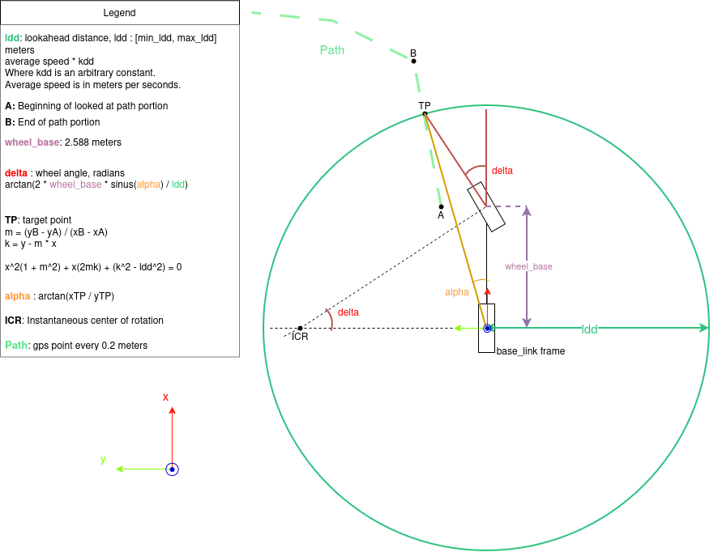

# av_nav

Repository for the ze50 Humble navigation.

## Nodes

### Zoe Follow Waypoint

Follow waypoint node is a pure pursuit algorithm that publishes the steer angle. See [Pure Pursuit algorithm](#pure-pursuit-algorithm).  
This node depends on a call from [ChangePath](#changepath) service to load path.  
Service works only if [waypoint_map_loader](#map-loader) is up and has a valid configuration file.

```bash
    ros2 run zoe_follow_waypoint zoe_follow_waypoint
```

Available arguments:

- **simu**, allows rviz2 simulation. Default: false
- **kdd**, a tuning parameter for the lookahead distance. Default : 1.2
- **min_ldd**, minimum lookahead distance. Default : 6.5
- **max_ldd**, max lookahead distance. Default : 30.0

### Map Loader

```bash
    ros2 run zoe_gps_waypoint waypoint_map_loader --ros-args -p config_file:=./path.yaml
```

Parses the waypoint into NavSatFix and Path messages.
The config file contains absolute paths for waypoints.

yaml file exemple:

```yaml
paths:
  - /home/to/path/path.txt
```

## Services

### ChangePath

```bash
    ros2 service call /change_path zoe_waypoint_interfaces/srv/ChangePath "{pathname: path.txt}"
```

## Pure Pursuit algorithm

Pure pursuit algorithm can be found in zoe_follow_waypoint file.


